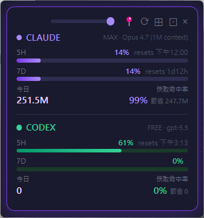

# ClaudeGauge

Windows 桌面懸浮儀表板，即時顯示 **Claude Code** 和 **OpenAI Codex** 訂閱方案的用量。



## 為什麼需要

- Claude Code 的 statusline 只在終端機內可見，離開終端就看不到
- Codex Desktop 沒有即時用量顯示
- 5 小時 / 7 天額度需要時刻警覺，避免趕專案時撞限

## 特色

- 🟪 **Claude** + 🟩 **Codex** 雙服務即時數據
- **5H / 7D rate limit** 進度條 + 重設倒數
- **今日 / 本月 token** 累計（解析 transcript）
- **快取命中率** + 節省 token 估算
- **模型分佈**（Sonnet / Opus / Haiku 色盲友善配色）
- **訂閱等級推斷**：依 `[1m]` 與 `context_window_size` 判斷 MAX / PRO
- 系統匣常駐 + 懸浮視窗兩種模式
- 透明度 slider + 釘選位置

## 技術棧

- **Electron 31** + React 18 + TypeScript
- **Zustand** 狀態管理
- **chokidar** file watcher
- **vite** 前端打包

## 資料來源

| 數據 | 來源 |
|------|------|
| Rate limits (5H/7D) | Claude Code statusLine stdin（透過 tee 攔截） |
| 模型 / 訂閱推斷 | `model.id` + `context_window` 欄位 |
| 今日 / 本月 token | `~/.claude/projects/**/*.jsonl` |
| 快取命中率 / 節省 | transcript 的 `cache_read_input_tokens` |
| Codex 全部數據 | `~/.codex/sessions/YYYY/MM/DD/rollout-*.jsonl` 的 `event_msg.token_count` |

## 安裝

```bash
git clone https://github.com/fantasy178/ClaudeGauge.git
cd ClaudeGauge
npm install
npm run build
```

然後雙擊 `start-app.cmd`，或直接 `node_modules/electron/dist/electron.exe .`。

## 啟用 Claude 資料流（重要）

ClaudeGauge 透過攔截 Claude Code 的 **statusLine 命令** 取得 `rate_limits`。第一次啟動後，必須執行一行 Node 腳本把 statusLine 換成我們的 tee（會自動把原本的 claude-hud 之類保留）：

```bash
node -e "const fs=require('fs');const p=require('os').homedir()+'/.claude/settings.json';const d=JSON.parse(fs.readFileSync(p));d.statusLine={type:'command',command:'node \"C:/Users/blue-/Desktop/AI/ClaudeGuage/dist-electron/services/statusline-tee.js\"'};if(d.hooks&&d.hooks.Stop){d.hooks.Stop=d.hooks.Stop.filter(g=>!g.hooks||!g.hooks.some(h=>h.comment==='claudegauge-hook'));if(!d.hooks.Stop.length)delete d.hooks.Stop;}fs.writeFileSync(p,JSON.stringify(d,null,2));console.log('done')"
```

如果你原本有用 [claude-hud](https://github.com/jarrodwatts/claude-hud) statusline，把它的命令寫到 `~/.claudegauge/statusline-original.json`（範本見 repo），tee 會自動轉發。

## 已知限制

- 跨機器同步：5H/7D 是伺服器層級，本身就跨機；但 token / 模型分佈只算本機 transcript（訂閱制無 API 可查）
- Codex 只支援桌面版（CLI 版的目錄結構不同）
- 僅支援 Windows（Mac/Linux 待補）

## 授權

MIT
